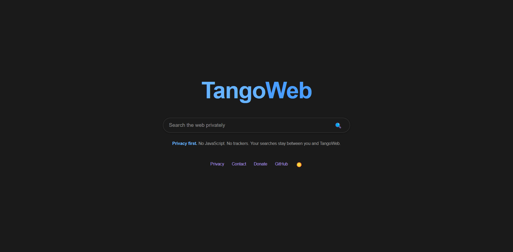

# TangoWeb
TangoWeb is a privacy-first, open-source search engine designed for the most private search experience. Privacy is a human right, and we believe you should be able to search something without your data being harvested, stored, logged, and tracked. This is your search engine.

# Privacy Policy
TangoWeb is built for privacy nerds, by privacy nerds. We respect your right to privacy online. We'll never ask for your information, searches, or keep logs on you.

# Open Source
TangoWeb is open source, meaning you can request to see the site's source code or visit our GitHub repository. You're already on our GitHub page, so that should be obvious.

# No trackers
- No analytics or advertising scripts
- No cookies
- No search history stored on our servers
- Strict Referrer-Policy: no-referrer headers
- Content Security Policy blocks all scripts

# Server-side search
When you search, your query is sent to this TangoWeb server only. The server then fetches results using the DDGS library and DuckDuckGo's instant answer API. Your browser never contacts search engines or trackers directly for search queries.

# External links
Result links take you to third-party websites. Those sites have their own privacy practices. Image and video thumbnails are loaded with referrerpolicy="no-referrer" to avoid leaking your visit.

# Data sources
- Web, image, video, and file results are fetched from DDGS metasearch
- Information box — DuckDuckGo instant answers and Wikipedia (via DDGS)
